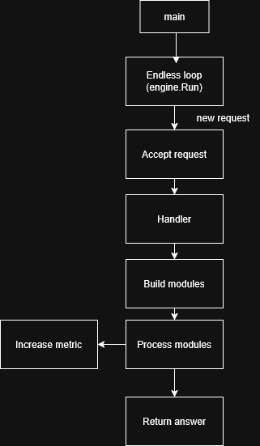

# Здравствуйте! 

## Этот репозиторий - пример того, как я пишу код.

Папки, за исключением src, пусты, и отображают то, как я примерно занимаюсь организацией папок.

## По проекту:

Проект представляет из себя некий движок HTTP-запросов, который их принимает, отправляет на обработку во вьюшку, там он вызывает некоторые модули, а затем возвращает ответ.

Структуру можно посмотреть ниже

Данный пример демонстрирует `исключительно` умение писать код. Не уверен, что это можно скомпилировать и запустить.

`Спасибо за внимание!`
